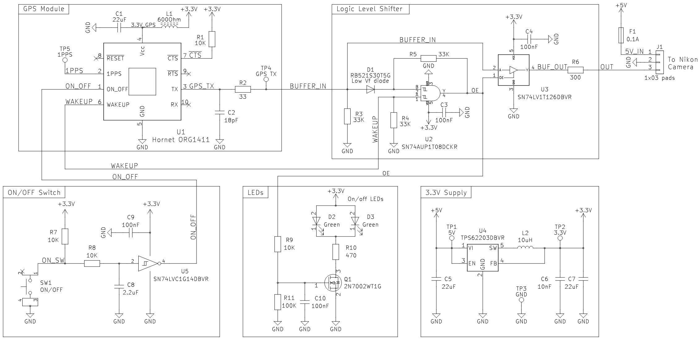
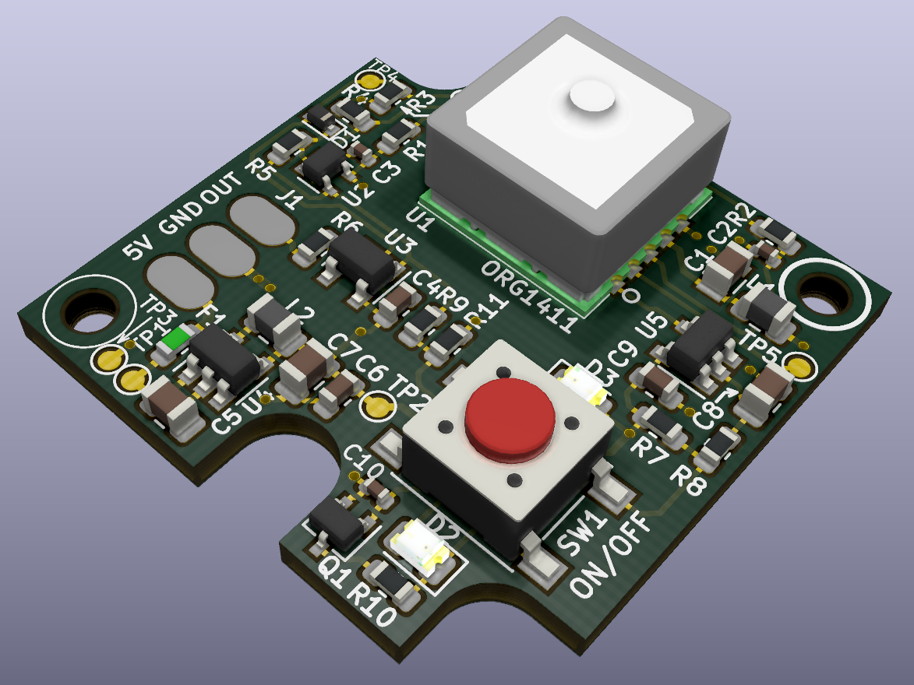
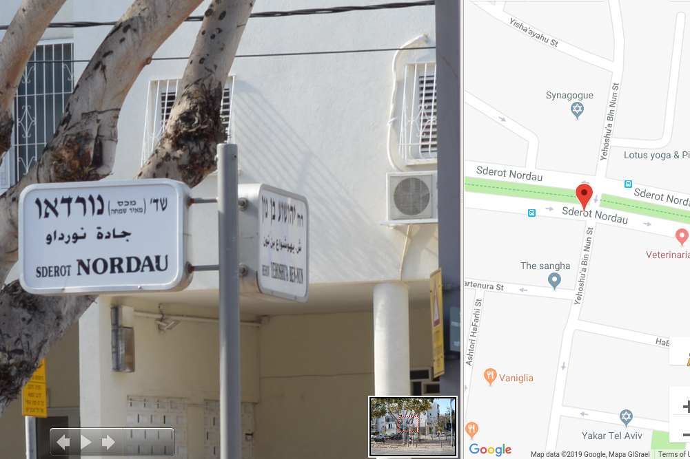

# DIY GPS Module for Nikon DSLR

External GPS module for Nikon DSLR.

## Overview

The idea of building a GPS for my Nikon DSLR me after building the [GPS module for my Yaesu VX-8DE transceiver](https://github.com/4x1md/vx8_gps). I searched the internet and found some projects, some of which had a very small size. For my project I chose RG1411 GPS module which is only 10x10mm in size. It requires 3.3V which can be supplied by the camera.

The first version of the GPS had a linear voltage regulator powering the GPS module. This solution had one big disadvantage: the GPS module was turned off completely and didn't keep any GPS data while it was off. Each time the module was turned on it had to acquire all the required GPS data again and consumed more current during the first minutes after power on. The delay of 3-5 minutes and even more made this GPS module impractical while walking in a city when I turned it on and off very often in order to save camera's battery.

The second version of this GPS project had the following changes:

1. The linear voltage regulator was replaced with a switching power supply with a very high efficiency at low currents.

2. On/off button puts the GPS module is a sleep mode instead of turning it off. In this mode it keeps the GPS data all the time when the GPS is connected to the camera and its start time is much shorter than during a full power-on cycle.

This document describes the latest version of this project. The first version of this project (revision A) is presented in [revision-a.md](docs/revision-a.md).

## Circuit Diagram

The project has the following circuits: GPS module, power supply, on/off switch, logic level shifter and LEDs. All the circuits are assembled on the same PCB.

1. **GPS module.** Hornet ORG1411 was chosen due to its small footprint and good performance. It is powered from the 3.3V supply and is connected in UART mode.

2. **Power supply.** TI TPS62203DBVR is a switching voltage regulator with fixed 3.3V output. It requires only an inductor and filter capacitors in order to work. It features more than 90% at the currents below 1mA. Such efficiency is important for reducing power consumption from the camera.

3. **On/off button.** The button is used to toggle the ON_OFF pin of the GPS for putting it into sleep mode or waking it up. The button is debounced by an RC-filter with a Schmitt trigger.

4. **Logic level shifter.** The logic level shifting circuit converts the 1.8V logic levels of the GPS to 3.3V levels required by the camera. When the GPS is in the sleep mode the level shifter enters high-Z mode. The enable pin of U3 is controlled by a circuit which acts like a flip-flop. If the WAKEUP pin of the GPS is LOW, the output of the AND gate U2 is also LOW and the output of U3 is disabled. After the GPS wakes up, its WAKEUP pin becomes HIGH, but the second input of U2 is still LOW, and its output continues LOW. When the UART TX of the GPS wakes up and becomes HIGH it toggles the output of U2 to HIGH. R5 pulls the B input of the AND gate up and the diode D1 prevents level of the B input from being changed to LOW by the UART RX when the latter transmits zero bits. The output of U2 will remain HIGH until the WAKEUP line falls to LOW again.

6. **LEDs.** The LEDs indicate that the GPS in in active state. They are controlled by the output of U2 and are turned off when the output buffer is in high-Z mode.

## Mechanics

The project is enclosed in a plastic box of 36x36x15mm. These boxes are cheap and are widely available on eBay/AliExpress.

## PCB Design

The PCB was designed in KiCAD. Its shape fits the plastic box shown above.

### 3D Model

### Manufactured PCB

## Assembled Device

## Device Tests

### Design Validation Tests

The tests were done in order to verify the assembled circuit. Refer to [development-tests-rev-b.md](docs/development-tests-rev-b.md) for test notes.

### ORG1411 GPS Module On/Off Tests

The on/off sequence of the ORG1411 GPS module was tested in order to understand how to connect an external on/off button to the module. Refer to [gps-on-off-tests.md](docs/gps-on-off-tests.md) for details.

### Field Tests

## Conclusions

The second version of the module works as I expected. I tested it in Tel Aviv, Budapest and Thessaloniki and it showed fast data acquisition and good precision. Currently, I'm not planning to develop it further.

## Links

### Reference projects

1. [A low-cost GPS module for Nikon DSLRs](https://github.com/marmat/nikon-gp1-diy) by Martin Matysiak
2. [Build Notes for DIY Nikon GPS](http://www.petermillerphoto.com/nikongps/nikongps2.html) by Peter Miller

### Technical data

1. [Nikon D90, D3100, D3200, D5000, D7000 focus / shutter MC-DC2 connector pinout](http://pinoutguide.com/DigitalCameras/nikon_d90_pinout.shtml)

## Questions? Suggestions?
You are more than welcome to contact me with any questions, suggestions or propositions regarding this project. You can:

1. Visit [my QRZ.COM page](https://www.qrz.com/db/4X5DM)
2. Visit [my Facebook profile](https://www.facebook.com/Dima.Meln)
3. Write me an email to iosaaris =at= gmail dot com

## Say Thanks

If you like this project, or found here some useful information and want to say thanks, or encourage me to do more, you can buy me a coffee!

73 de 4X1MD
