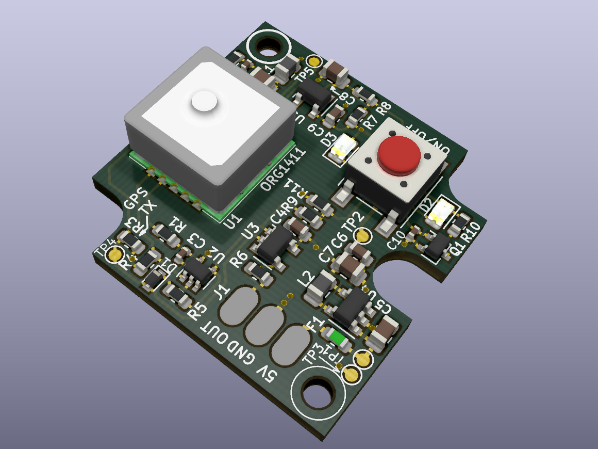
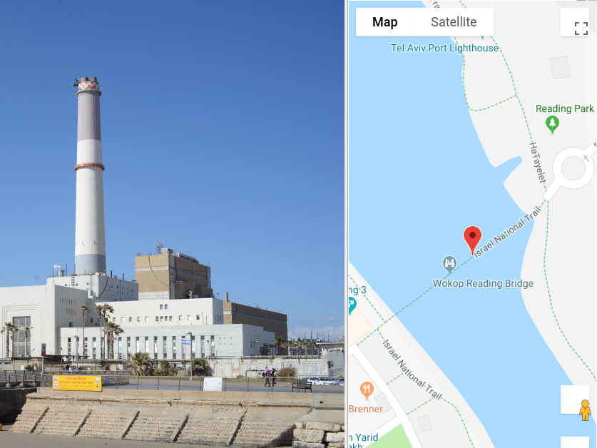

# DIY GPS Module for Nikon DSLR
GPS module for Nikon DSLR.

## Overvies

TBD

## Reference Projects

TBD

## Parts

TBD

## Mechanics

## PCB Design

The PCB was designed in KiCAD.

### PCB schematics

### 3D Model

### Manufactured PCB

## BOM Variants

TBD

## Assembled Device

## Development Tests

### Revision A Tests

Please refer to [development-tests.md](docs/development-tests.md) for details.

### ORG1411 GPS Module On/Off Tests

Please refer to [wakeup-tests.md](docs/wakeup-tests.md) for details.

## Field Tests

## Conclusions

TBD

## Links

1. [A low-cost GPS module for Nikon DSLRs](https://github.com/marmat/nikon-gp1-diy) by Martin Matysiak
2. [Build Notes for DIY Nikon GPS](http://www.petermillerphoto.com/nikongps/nikongps2.html) by Peter Miller
3. [Nikon D90, D3100, D3200, D5000, D7000 focus / shutter MC-DC2 connector pinout](http://pinoutguide.com/DigitalCameras/nikon_d90_pinout.shtml)

## Questions? Suggestions?
You are more than welcome to contact me with any questions, suggestions or propositions regarding this project. You can:

1. Visit [my QRZ.COM page](https://www.qrz.com/db/4X5DM)
2. Visit [my Facebook profile](https://www.facebook.com/Dima.Meln)
3. Write me an email to iosaaris =at= gmail dot com

73 de 4X1MD
