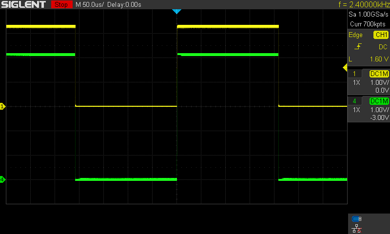
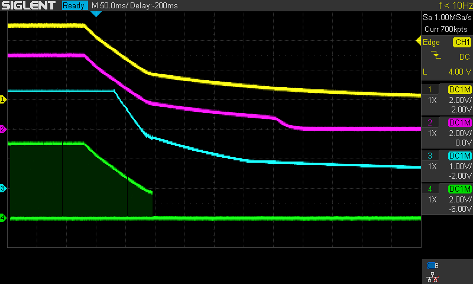
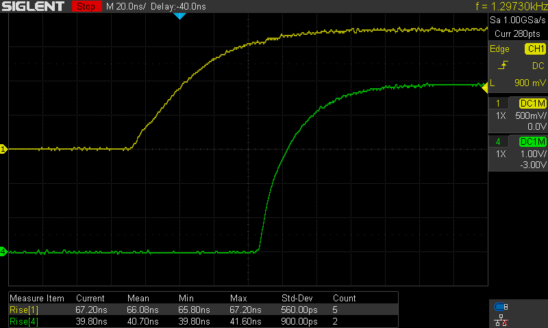
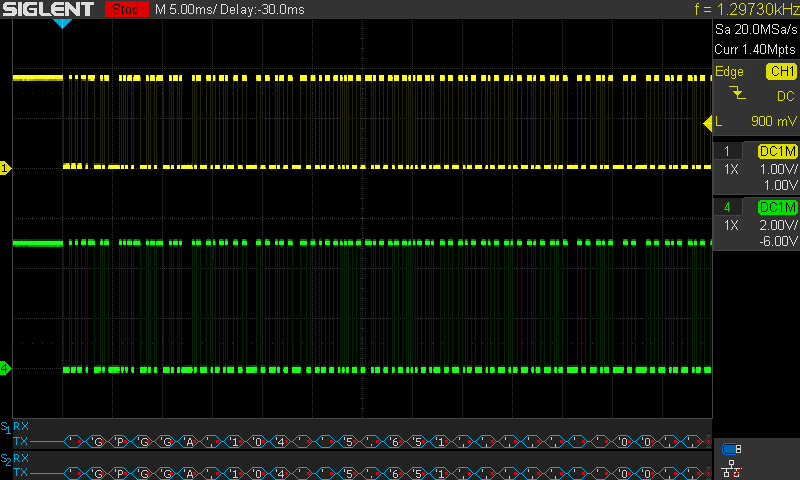

# Development tests of DIY GPS for Nikon DSLR

## Test equipment

1. Siglent SDS1204X-E oscilloscope
2. GOPHET CPS-3205 II power supply
3. UNI-T UT61E DMM
4. Siglent SDG1032X signal generator

## Tested Circuit

## Tests without the GPS module
The GPS module is hard to manually solder and especially desolder. Thus, before assembling it, I wanted to make sure that the circuit works as expected.

### Power-on

Channel  | Signal
--- | ---
**CH1:** | 5V
**CH2:** | 3.3V_EN (U4.3)
**CH3:** | 3.3V
**CH4:** | GPS_OUT

### Power-off

Channel  | Signal
--- | ---
**CH1:** | 5V
**CH2:** | 3.3V_EN (U4.3)
**CH3:** | 3.3V
**CH4:** | GPS_OUT

### On/off button

**Turning 3.3V on**

Channel  | Signal
--- | ---
**CH2:** | ON_SW (U3.1)
**CH3:** | 3.3V_EN (U4.3)
**CH4:** | 3.3V

**Turning 3.3V off**

Channel  | Signal
--- | ---
**CH2:** | ON_SW (U3.1)
**CH3:** | 3.3V_EN (U4.3)
**CH4:** | 3.3V

### Logic level shifting

Logic level shifting was tested by injecting pulses to the input of U2. Pulse frequency was 2400Hz and amplitude 3.3V.

**Rise time**

**Fall time**

**Output pulses with 3.3V input**

**Logic level shifting with 2.475V input**

According to ORG1411 datasheet, it has the following logic levels:

Parameter | Symbol | Min | Max | Unit
---|---|---|---|---
Output Voltage Low State | VOL | | 0.4 | V
Output Voltage High State | VOH | 0.75*Vcc | | V

Vcc in this circuit is 3.3V, therefore, VHIGH is 2.475V.

Later, tests with GPS module demonstrated that these pulses don't reflect the real-world voltage levels.

Channel  | Signal
--- | ---
**CH1:** | GPS_TX (C2)
**CH4:** | GPS_OUT

## Tests with the GPS module

The same tests were performed with the GPS module assembled.

### Power-on

Channel  | Signal
--- | ---
**CH1:** | 5V
**CH2:** | 3.3V_EN (U4.3)
**CH3:** | 3.3V
**CH4:** | GPS_OUT

### Power-off

The pulses on the GPS_OUT line are UART transmissions of the GPS module.

Channel  | Signal
--- | ---
**CH1:** | 5V
**CH2:** | 3.3V_EN (U4.3)
**CH3:** | 3.3V
**CH4:** | GPS_OUT

### On/off button

**Turning 3.3V on**

Channel  | Signal
--- | ---
**CH2:** | ON_SW (U3.1)
**CH3:** | 3.3V_EN (U4.3)
**CH4:** | 3.3V

**Turning 3.3V off**

Channel  | Signal
--- | ---
**CH2:** | ON_SW (U3.1)
**CH3:** | 3.3V_EN (U4.3)
**CH4:** | 3.3V

### Logic level shifting

**Rise time**

**Fall time**

**Output pulses with 3.3V input**

Channel  | Signal
--- | ---
**CH1:** | GPS_TX (C2)
**CH4:** | GPS_OUT

This test shows that the real logic levels of the ORG1410-PM04 UART is 1.8V. According to the SN74LV1T126DBVR datasheet, it is not supposed to work with 1.8V input when powered with 5.0V. This test shows that it works well, however, its performance can't be guaranteed.

### UART waveforms

Channel  | Signal
--- | ---
**CH1:** | GPS_TX (C2)
**CH4:** | GPS_OUT
