# Design validation DIY GPS for Nikon DSLR Revision B

## Test equipment

1. Siglent SDS1204X-E oscilloscope
2. GOPHET CPS-3205 II power supply
3. UNI-T UT61E DMM
4. Siglent SDG1032X signal generator

## Tested Circuit
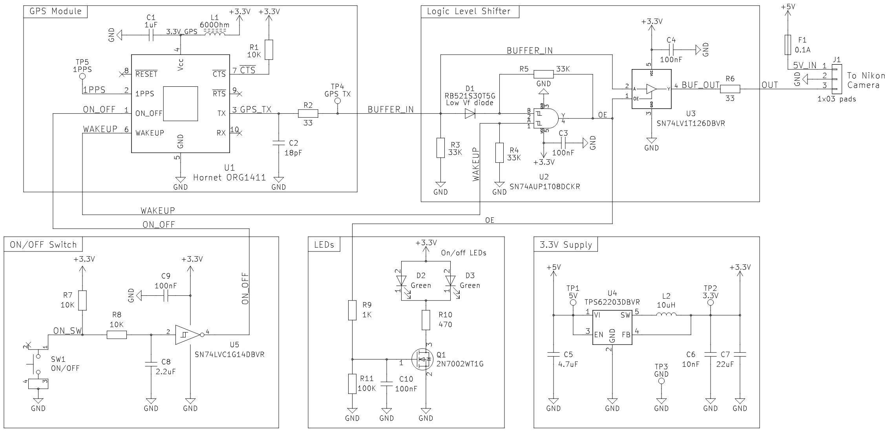

## Tests without GPS module
The GPS module is hard to manually solder and especially desolder. Therefore, before assembling it, I needed to make sure that all the other circuits work as expected.

### Power supply

#### Wake-up with no load

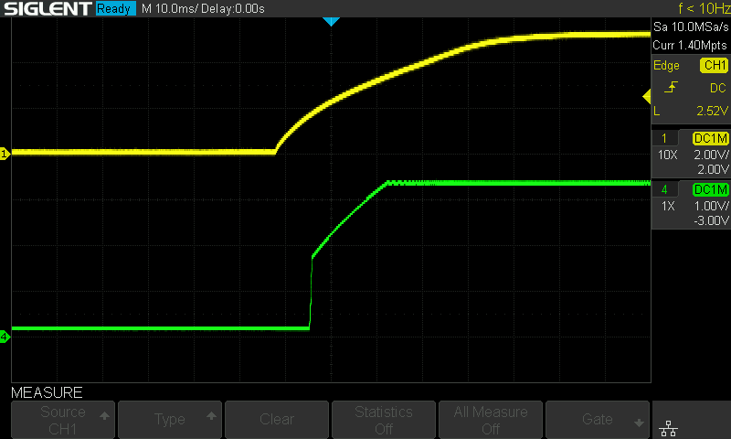

Channel | Signal |
--- | ---
**CH1:** | 5V input (TP1)
**CH4:** | 3.3V (TP2)

#### Power-off with no load

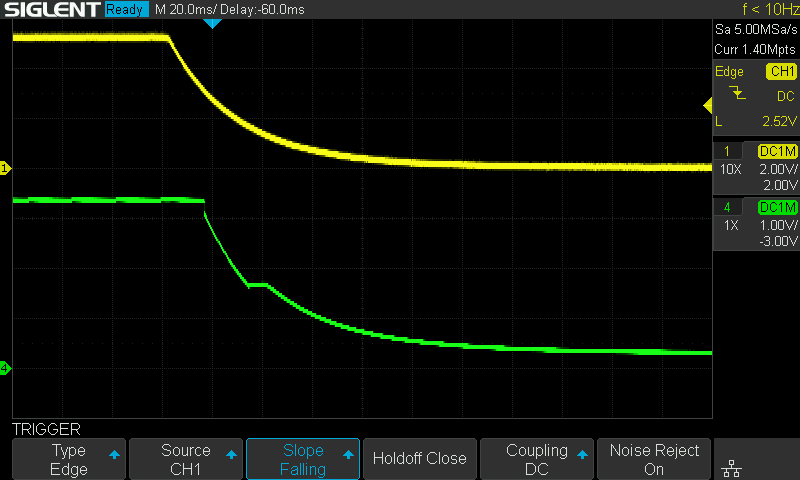

Channel | Signal |
--- | ---
**CH1:** | 5V input (TP1)
**CH4:** | 3.3V (TP2)

#### Wake-up with load

Wake-up with load was tested with a 33 Ohm resistor (100mA load current) connected between the buck output and GND.

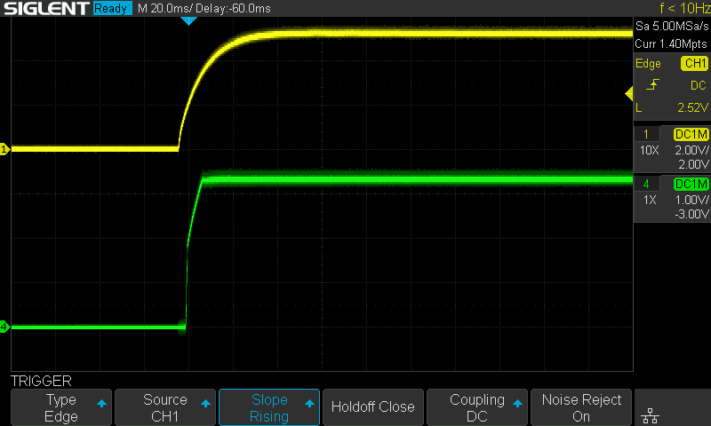

Channel | Signal |
--- | ---
**CH1:** | 5V input (TP1)
**CH4:** | 3.3V (TP2)

#### Power-off with load

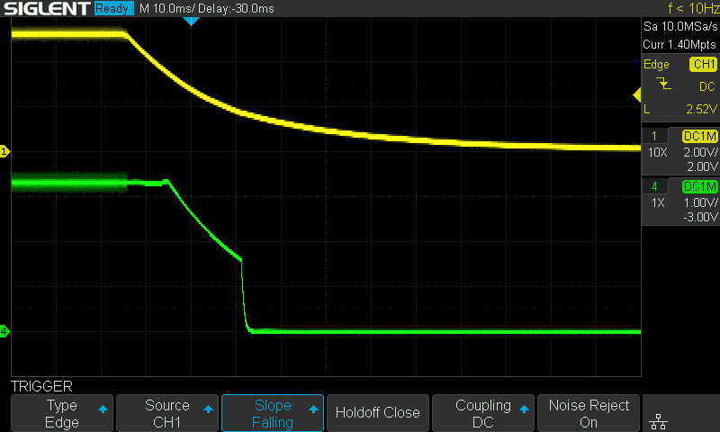

Channel | Signal |
--- | ---
**CH1:** | 5V input (TP1)
**CH4:** | 3.3V (TP2)

#### Zoom-in on the wake-up with load

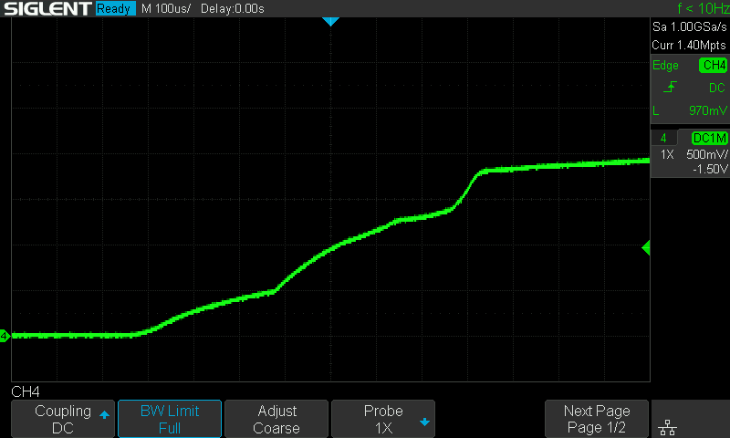

Channel | Signal |
--- | ---
**CH4:** | 3.3V (TP2)

Wake-up of 3.3V matches output voltage start-up shown in the datasheet:

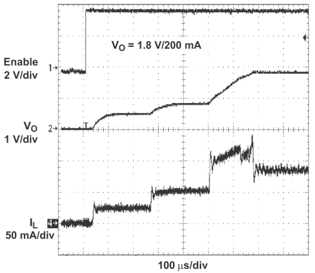

#### Ripple without load

According to the datasheet, at light load currents, the device operates in power save mode and the output voltage ripple is independent of the output capacitor value. The output voltage ripple is set by the internal comparator thresholds. The typical output voltage ripple is 1% of the output voltage, therefore we'd expect ripple of 33mVpp. The measured ripple is ~27mVpp.

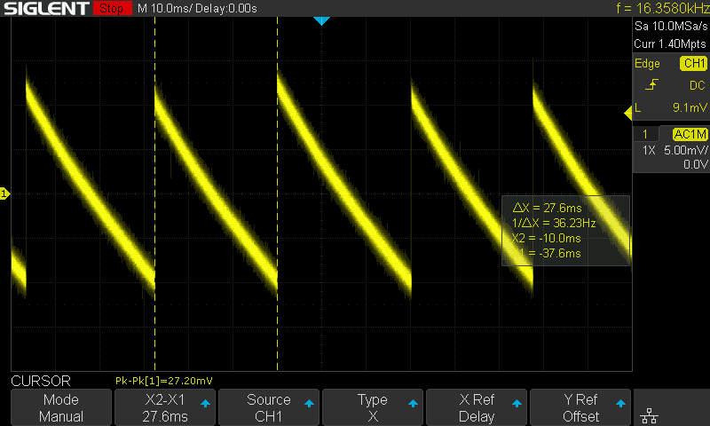

Channel | Signal |
--- | ---
**CH1:** | 3.3V (TP2)

#### Ripple with 100mA load

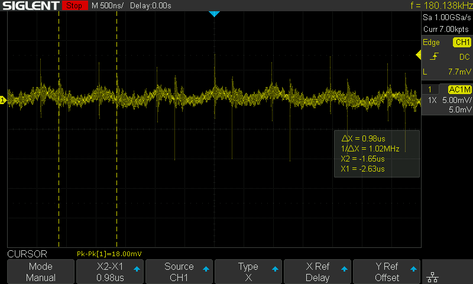

Channel | Signal |
--- | ---
**CH1:** | 3.3V (TP2)

The converter shows a very low ripple at 100mA load.

#### Ripple with 15mA load

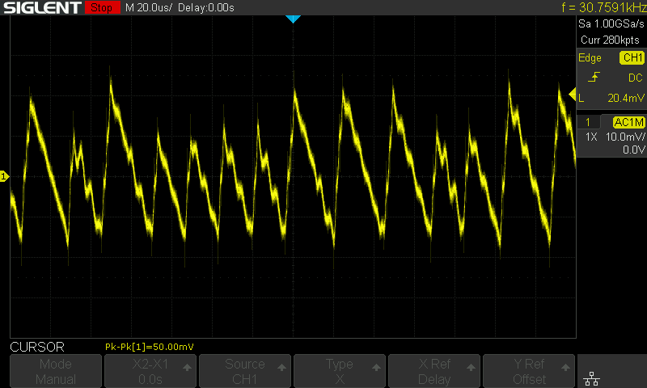

Channel | Signal |
--- | ---
**CH1:** | 3.3V (TP2)

#### Ripple with 40mA load

40mA current was chosen as a typical load current of the GPS module.

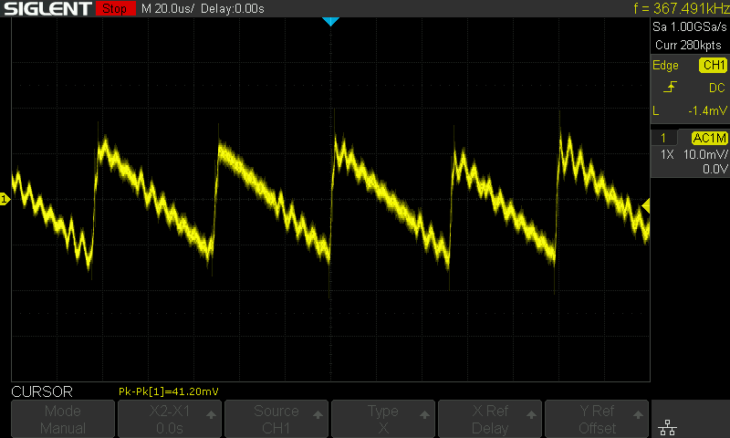

Channel | Signal |
--- | ---
**CH1:** | 3.3V (TP2)

### Line regulation

The DC-DC converter was tested with a load of 70 Ohm consisting of a 68 Ohm resistor and 2 Ohm internal resistance of the ammeter.

Test conditions | Vin, V | Iin, mA | Vout, V | Iout, mA | Efficiency, %
--- | --- | --- | --- | --- | ---
Vin = 4.5V, RL=70 Ohm | 4.498 | 36.59 | 3.3431 | 46.60 | 94.65%
Vin = 5.0V, RL=70 Ohm | 5.004 | 34.23 | 3.3434 | 47.90 | 93.49%
Vin = 5.5V, RL=70 Ohm | 5.503 | 31.66 | 3.3426 | 48.40 | 92.86%

### Load regulation

Load regulation was tested with three load currents: 5mA, 50mA and 100mA. It was difficult to get precise currents because fixed resistors were used as loads.

Test conditions | Vin, V | Iin, mA | Vout, V | Iout, mA | Efficiency, %
--- | --- | --- | --- | --- | ---
Vin = 5.0V, RL=682 Ohm | 5.0099 | 3.59 | 3.3407 | 5.00 | 92.77%
Vin = 5.0V, RL=70 Ohm | 5.0039 | 34.58 | 3.3434 | 48.50 | 93.71%
Vin = 5.0V, RL=35 Ohm | 5.0043 | 67.09 | 3.3107 | 94.50 | 93.19%

### Dynamic Load

Dynamic load was tested with a fixed resistors, switched by a MOSFET. Switching frequency was 1kHz with duty cycle of 50%. A sense resistor of 1 Ohm was used to monitor the load current.

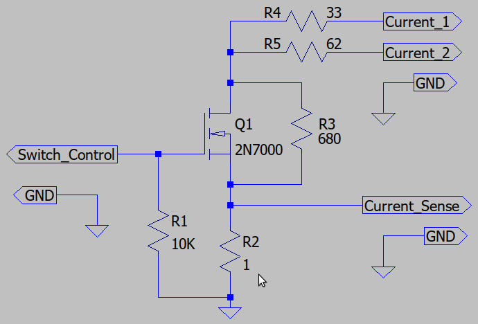

**Switching between 4.4mA and 52mA (743 Ohm and 62 Ohm)**

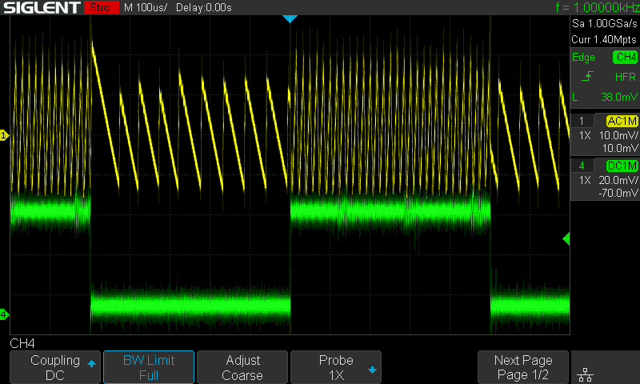

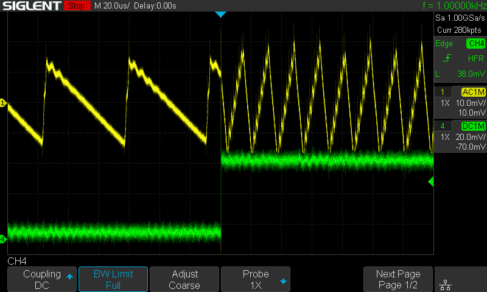

Channel | Signal |
--- | ---
**CH1:** | 3.3V (TP2)
**CH4:** | Current sense

The waveforms show ripple frequency and amplitude change when the load current changes.

**Switching between 4.6mA and 87mA (714 Ohm and 33 Ohm)**

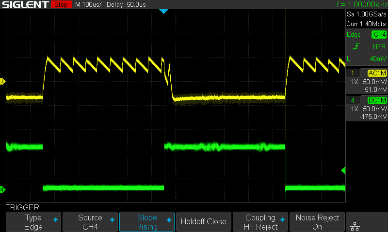

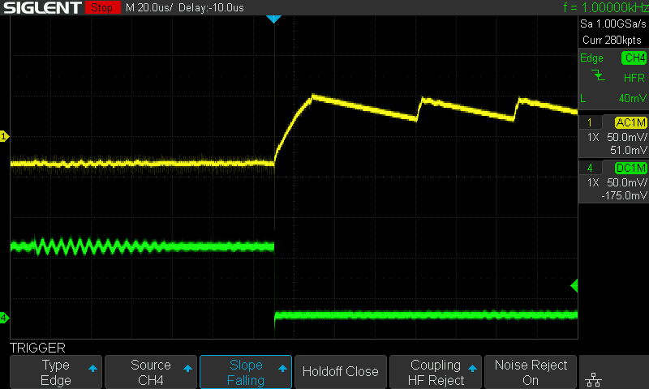

Channel | Signal |
--- | ---
**CH1:** | 3.3V (TP2)
**CH4:** | Current sense

There are spikes of approx. 200mV when the load current changes from 4.6mA to almost 100mA. According to the datasheet of TPS62203, such spikes are normal for large load current changes.

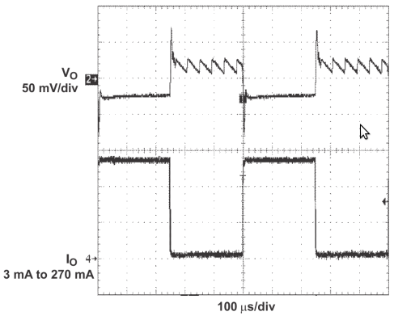

#### Results and conclusions

At first, the output capacitor was 10uF. The ripples were 37mVpp at light loads and 76mVpp at 100mA. After changing the capacitor to 22uF, the ripples became 27.2mVpp and 18mVpp which is acceptable for this design.

Ripple at low currents (15-40mA) reaches 50mV which is relatively high, but the GPS module has a built-in LDO which is supposed to be able to deal with it.

According to the datasheet of the ORG1411 GPS, it can have inrush current of up to 100mA for about 20μs. Maximum steady-state current is 47mA during acquisition. The power supply used in this project will be able to supply these currents to the GPS module.

### On/off button

#### Wake-up

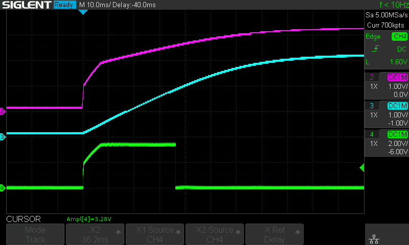

Channel | Signal
--- | ---
**CH2:** | Push button (SW1.1)
**CH3:** | Schmitt trigger in (U5.2)
**CH4:** | Schmitt trigger out (U5.4)

Pulse duration on the output of the Schmitt trigger is 36.4ms. Start time of the GPS module is at least 300ms. During the start period of the GPS module the state of the ON_OFF pin is ignored.

#### On/off pulse on button press

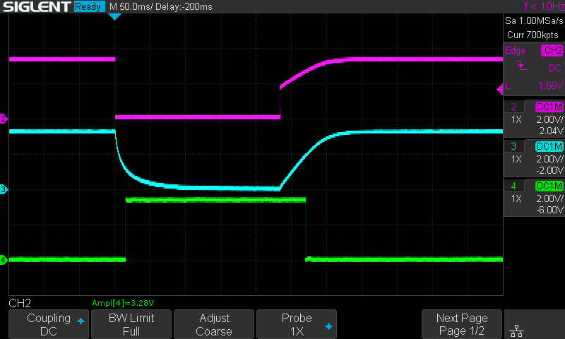

Channel | Signal
--- | ---
**CH2:** | Push button (SW1.1)
**CH3:** | Schmitt trigger in (U5.2)
**CH4:** | Schmitt trigger out (U5.4)

On/off pulse duration is around 254ms and depends on the time the button remains pressed. ORG1411 datasheet recommends ON_OFF pulse duration of 100ms or higher.

#### Button debouncing

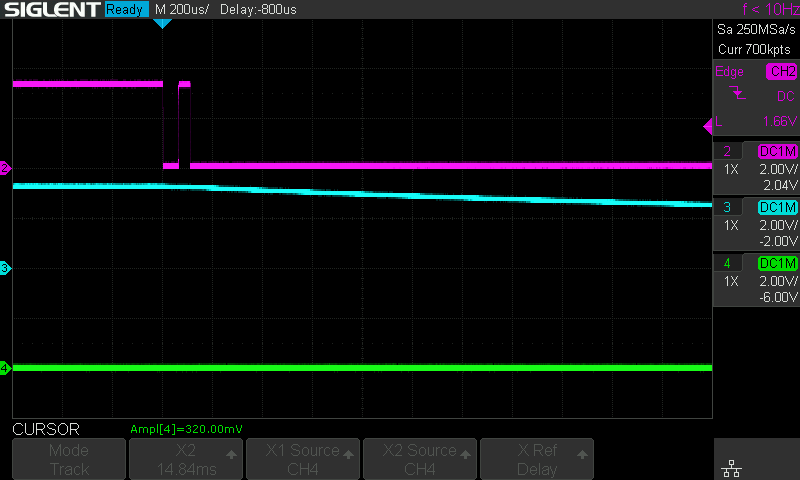

Channel | Signal
--- | ---
**CH2:** | Push button (SW1.1)
**CH3:** | Schmitt trigger in (U5.2)
**CH4:** | Schmitt trigger out (U5.4)

The debouncing time of the circuit is approx. 14.8ms. Increasing R8 will increase this time.

#### Results and conclusions

Push button debouncing circuit works as expected.

### Logic level shifter and output enable

#### Wake-up

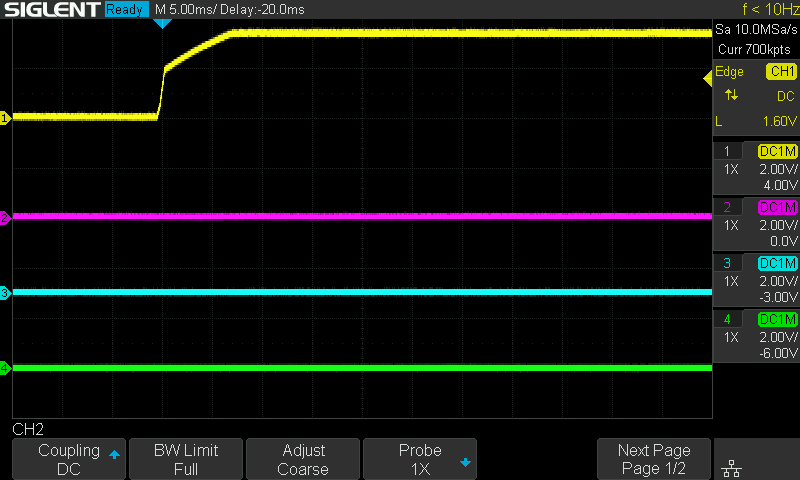

Channel | Signal
--- | ---
**CH1:** | 3.3V (TP2)
**CH2:** | Buffer in (TP4)
**CH3:** | OE (U3.1)
**CH4:** | Out (J1.3)

#### Power-off

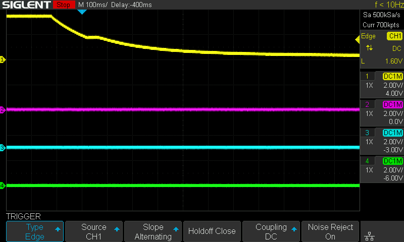

Channel | Signal
--- | ---
**CH1:** | 3.3V (TP2)
**CH2:** | Buffer in (TP4)
**CH3:** | OE (U3.1)
**CH4:** | Out (J1.3)

#### Output enable

Output enable circuit works as a latch. After WAKEUP signal of the GPS becomes HIGH, the latch is triggered by the first UART TX LOW-HIGH transition and the AND gate output becomes HIGH. In this state, resistor R5 pulls the B input of the AND gate up independently of the UART TX level. When WAKEUP signal changes to LOW, the gate output level becomes to LOW too. In this state HIGH level on UART TX is unable to change the output level of the AND gate.

The AND gate has Smitt trigger inputs with VT+ in the range of 0.75-1.16V and VT- in the range of 0.5-0.85V.

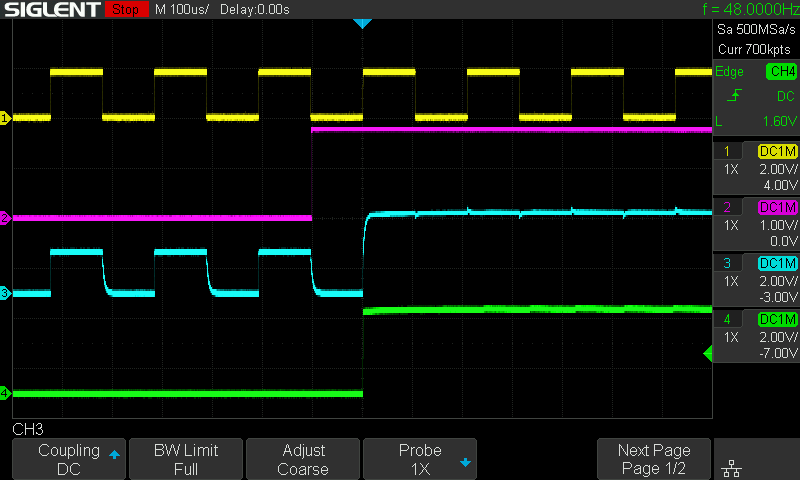

Channel | Signal
--- | ---
**CH1:** | Buffer in (TP4)
**CH2:** | WAKEUP (U2.1)
**CH3:** | AND gate B input (U2.2)
**CH4:** | OE (U2.4)

#### Output disable

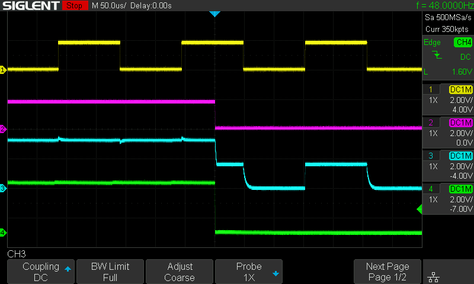

Channel | Signal
--- | ---
**CH1:** | Buffer in (TP4)
**CH2:** | WAKEUP (U2.1)
**CH3:** | AND gate B input (U2.2)
**CH4:** | OE (U2.4)

#### Level shifting

U3 converts 1.8V logic levels from the GPS to 3.3V required by the camera.

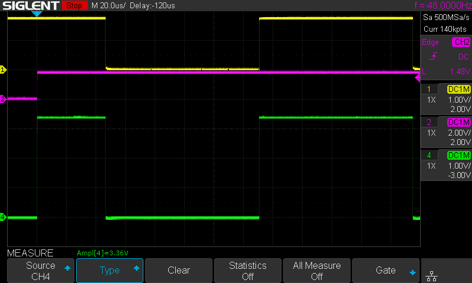

Channel | Signal
--- | ---
**CH1:** | Buffer in (TP4)
**CH2:** | WAKEUP (U2.1)
**CH4:** | Out (J1.3)

#### Results and conclusions

Output enable and level shifting circuits work as expected.

## Tests with the GPS module assembled

#### Wake-up with GPS assembled

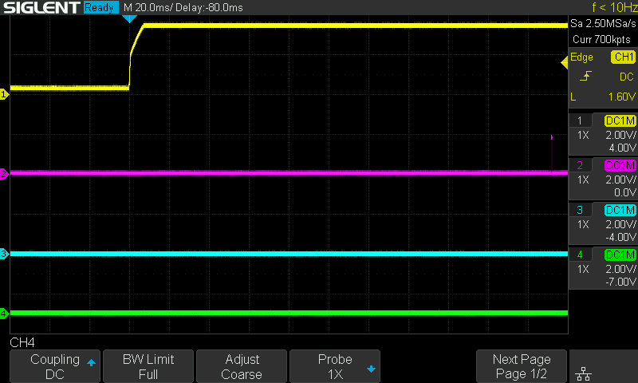

Channel | Signal |
--- | ---
**CH1:** | 3.3V (TP2)
**CH2:** | WAKEUP (U2.1)
**CH3:** | UART TX (TP4)
**CH4:** | Out (J1.3)

#### Power-off with GPS assembled

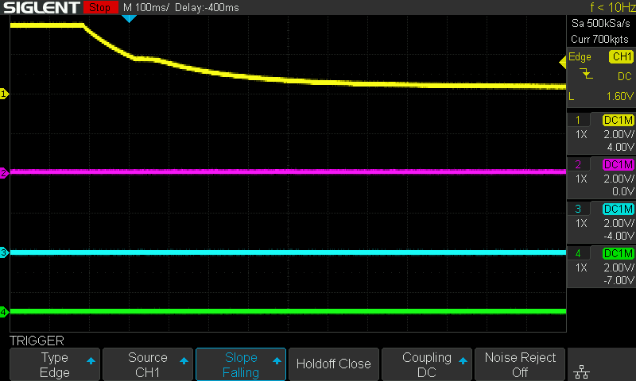

Channel | Signal |
--- | ---
**CH1:** | 3.3V (TP2)
**CH2:** | WAKEUP (U2.1)
**CH3:** | UART TX (TP4)
**CH4:** | Out (J1.3)

#### GPS on

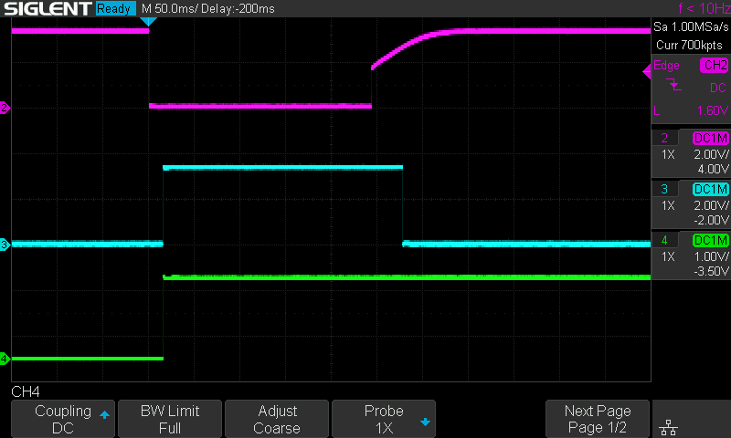

Channel | Signal |
--- | ---
**CH2:** | Push button (SW1.1)
**CH3:** | GPS ON_OFF (U5.4)
**CH4:** | WAKEUP (U2.1)

**Ripple of the 3.3V supply when GPS turns on**

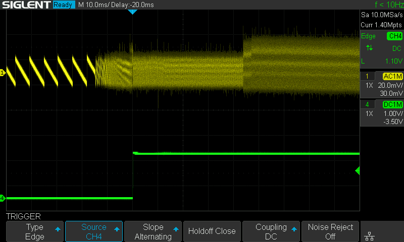

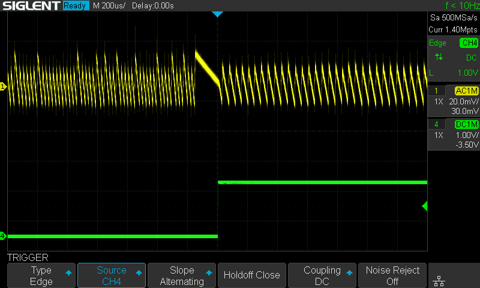

Channel | Signal |
--- | ---
**CH1:** | 3.3V (TP2)
**CH4:** | WAKEUP (U2.1)

#### GPS off

Channel | Signal |
--- | ---
**CH2:** | Push button (SW1.1)
**CH3:** | GPS ON_OFF (U5.4)
**CH4:** | WAKEUP (U2.1)

**Ripple of the 3.3V supply when GPS turns off**

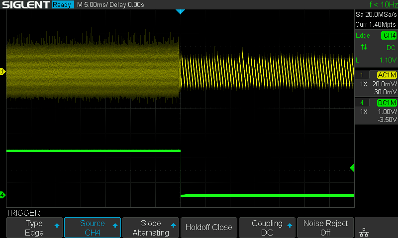

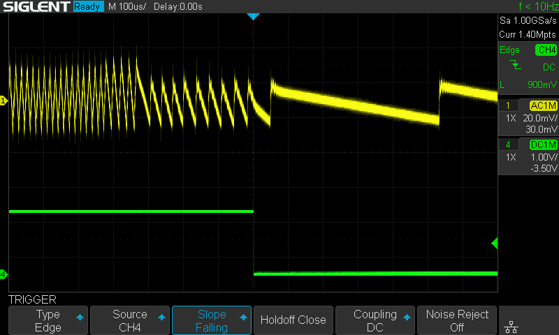

Channel | Signal |
--- | ---
**CH1:** | 3.3V (TP2)
**CH4:** | WAKEUP (U2.1)

#### GPS wake-up and buffer otuput enable

**GPS on**

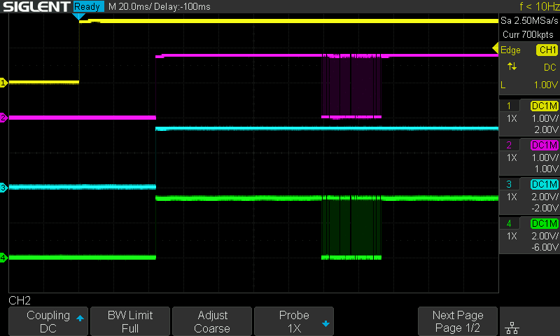

Channel | Signal |
--- | ---
**CH1:** | GPS ON_OFF (U5.4)
**CH2:** | UART TX (TP4)
**CH3:** | OE (U2.4)
**CH4:** | Out (J1.3)

**GPS off**

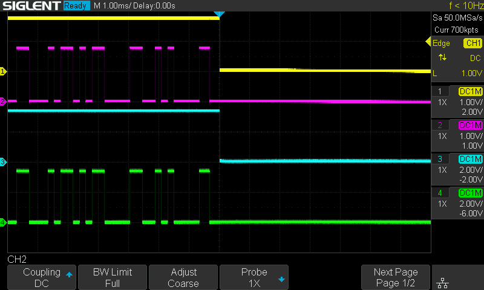

Channel | Signal |
--- | ---
**CH1:** | GPS ON_OFF (U5.4)
**CH2:** | UART TX (TP4)
**CH3:** | OE (U2.4)
**CH4:** | Out (J1.3)

#### Logic levels

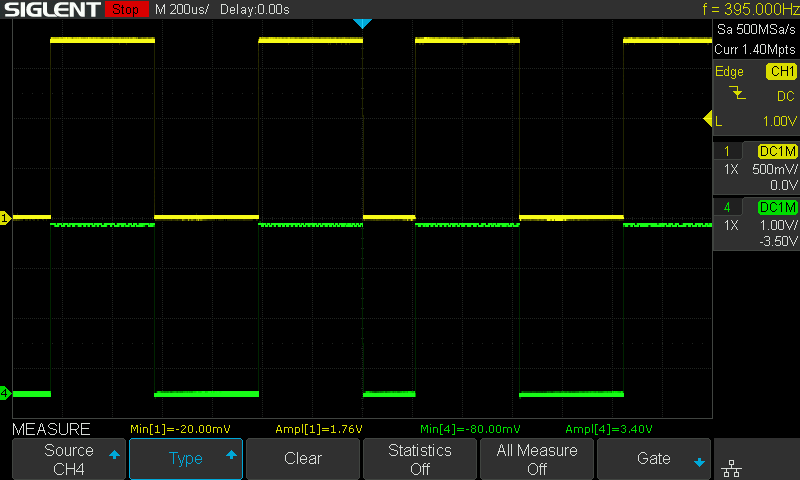

Channel | Signal |
--- | ---
**CH1:** | UART TX (TP4)
**CH4:** | Out (J1.3)

#### Power consumption

After wake-up, the GPS module enters the acquisition state and consumes around 60mA. Then, after 6-7 minutes, when tested inside a building, it enters the tracking state and consumes around 30mA. When it is turned off by toggling the ON_OFF pin, it consumes less than 100uA.

The circuit with all the additional components consumes 43-47mA in acquisition mode after wake-up, 23-25mA in the tracking mode and 40uA when the GPS is turned off. In the tracking mode after the position is acquired, current consumption doesn't change much and remains in the range of 20-25mA.

**Input current after power off**

During the first 60 seconds the circuit is in the off mode and the input current is at its minimum of ~40uA. Then, during approx. 6 minutes, the circuit consumes ~40-45mA. Then, it is turned off and consumes ~40uA again.

**Input current after turning the circuit off and on again**

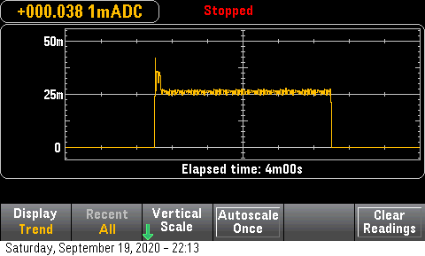

In this test the GPS was put to the standby state by the On/off button and then was put to the active state again. The acquisition state lasts approximately 20 seconds, then the module enters the tracking state and the circuit consumes ~25mA.

## Tests with the camera

The next step was to test the circuit connected to my Nikon D610. The camera supplies voltage of 5-6V depending on the load current.

### Input voltage ripple

The aim of these tests is to measure the ripple voltage on the input voltage which comes from the camera.

#### GPS off

Input ripple when the GPS module is in hibernate state. In this state it consumes ~40uA and switching frequency of the buck converter is very low. The input voltage is 5.909V.

Channel | Signal |
--- | ---
**CH1:** | 5V (TP1)

#### GPS in acquisition mode

In this mode the circuit draws ~47mA from the source. Voltage supplied by the camera is 5.695V.

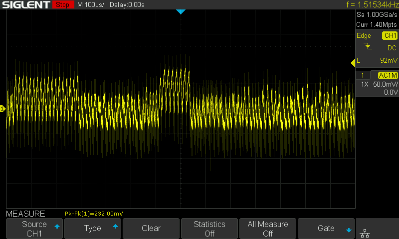

Channel | Signal |
--- | ---
**CH1:** | 5V (TP1)

#### GPS in tracking mode

In this mode the circuit draws ~25mA from the source. Voltage supplied by the camera is 5.720V.

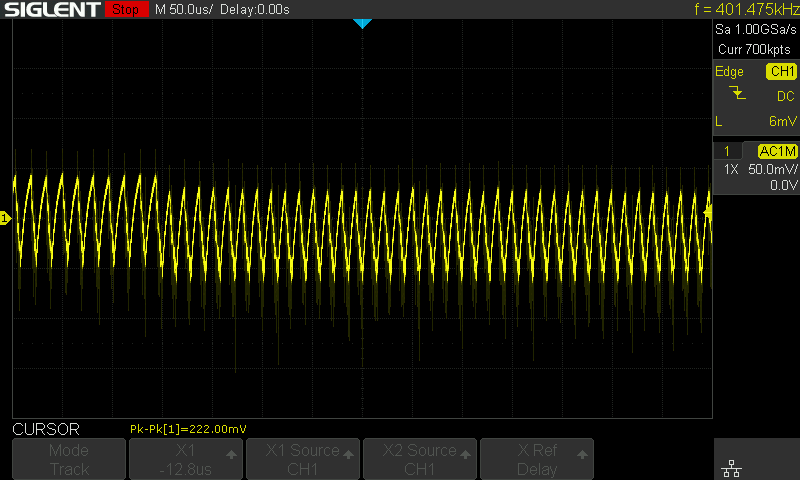

Channel | Signal |
--- | ---
**CH1:** | 5V (TP1)

#### Reducing input ripples

These ripple voltages look high. They depend on the value of C5 whose value was 4.7uF in the previous tests. The following waveforms were obtained after increasing the value of C5 to 22uF.

**GPS off**

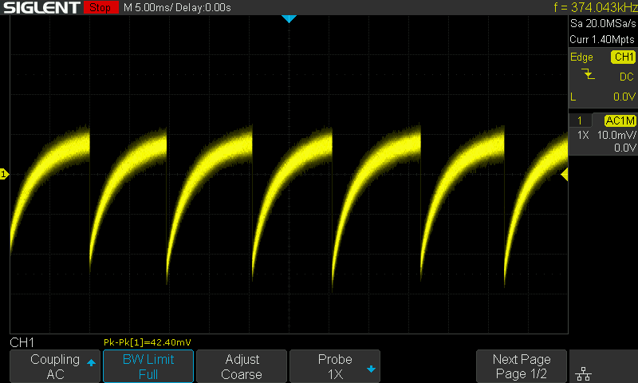

**Acquisition mode**

**Tracking mode**

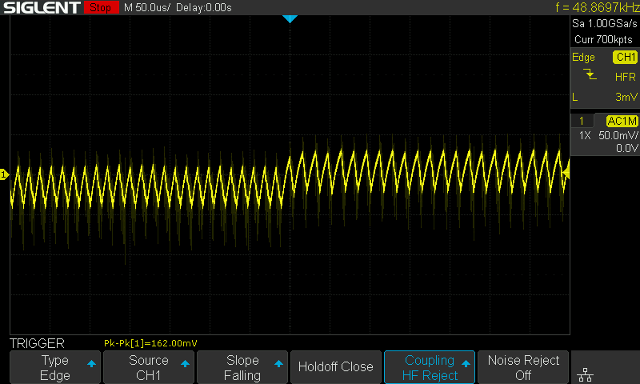

Channel | Signal |
--- | ---
**CH1:** | 5V (TP1)

Increasing C5 to 22uF reduced the ripples by approximately 50%.

#### Ripple on the GPS module

Ripple voltages on the GPS module (U1 pin 4) were too high: 43.2mVpp, 56mvpp and 49.6mVpp in hibernate, acquisition and tracking modes accordingly. The high ripples on 3.3V were caused by high input ripples of the camera power supply. I had to increase the value of C1 to 22uF in order to reduce the ripple voltage.

**GPS off**

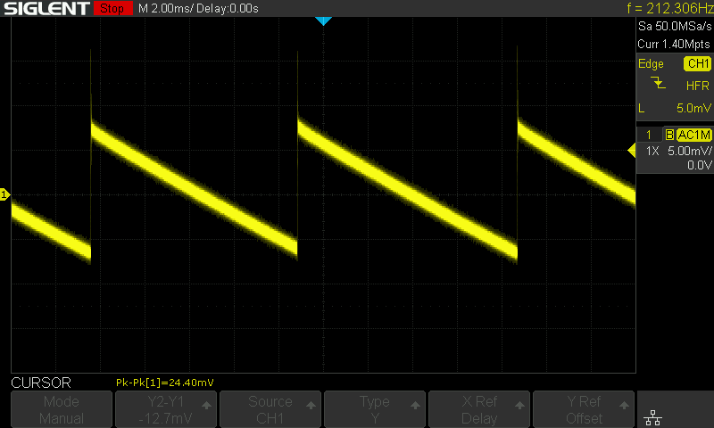

The ripple is ~13mVpp not including the small spikes.

**Acquisition mode**

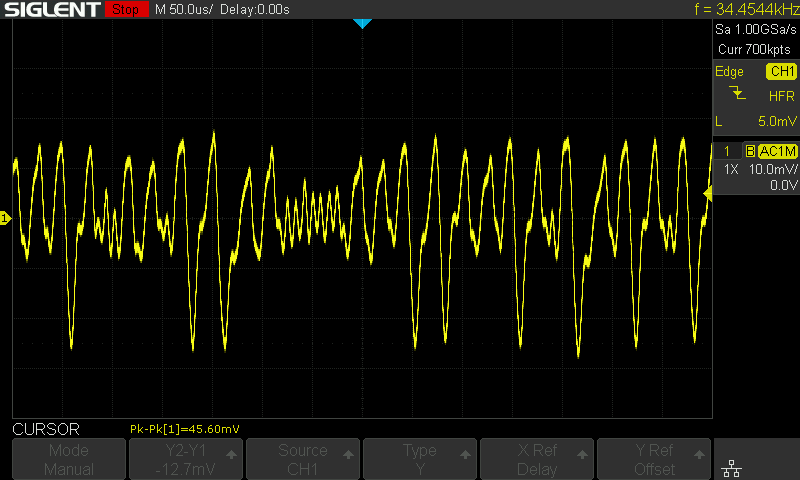

**Tracking mode**

In the tracking mode the current of the GPS module changes many times per second. It can be seen on the amplitude and frequency of the ripple voltage. During the time of high current consumption the ripple falls to ~15mVpp and when the GPS current is low, the ripple can reach ~50mVpp. The GPS module has an internal LDO which should be able to deal with such ripple.

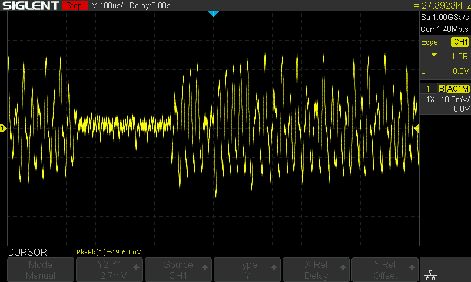

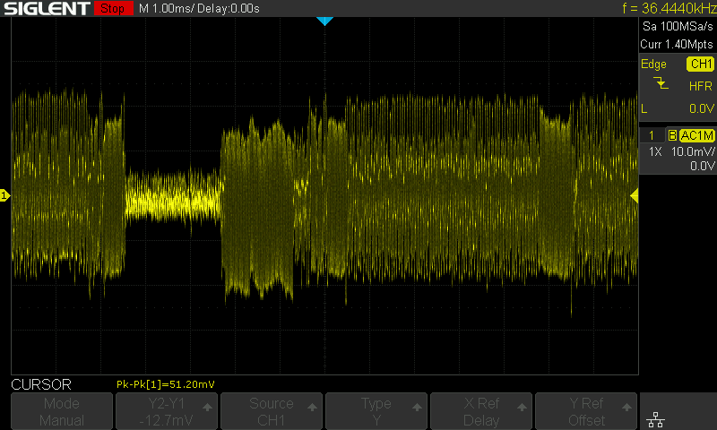

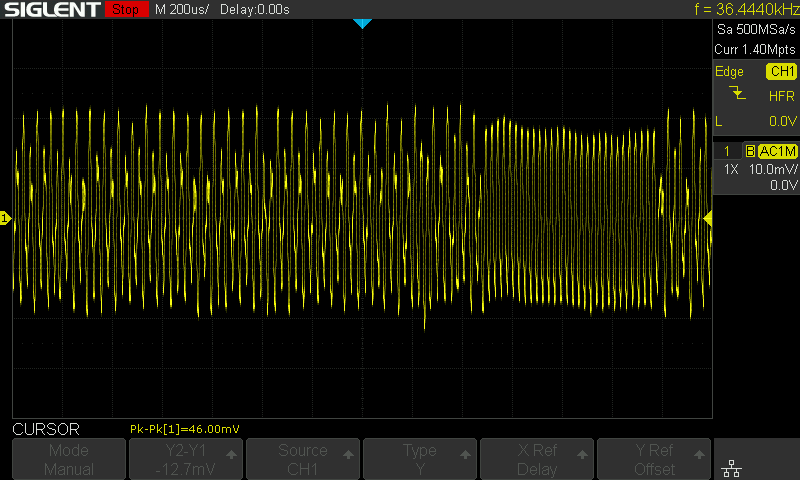

Channel | Signal |
--- | ---
**CH1:** | 3.3V (TP2)

**Tracking mode after acquiring position**

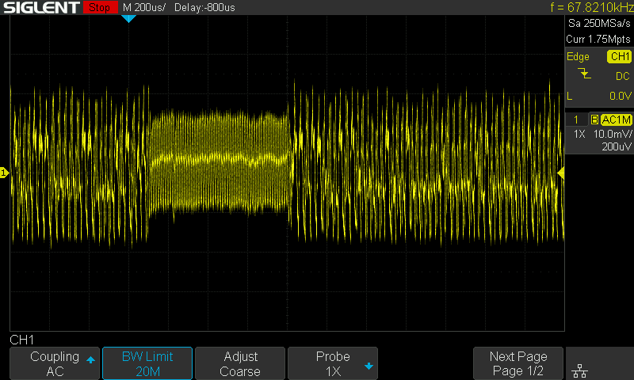

Channel | Signal |
--- | ---
**CH1:** | 3.3V (TP2)

### GPS on and off

When nothing is connected to the camera, the voltage on the UART pin of the GPS connector is 2.7V. In order to prevent possible overload, I changed R6 from 33 Ohm to 300 Ohm.

When the GPS is turned off, the output of U3 enters Hi-Z state and the voltage on its output is set by the camera. It explains why when the GPS is off, the voltage on U3 output is 2.7V.

#### GPS on

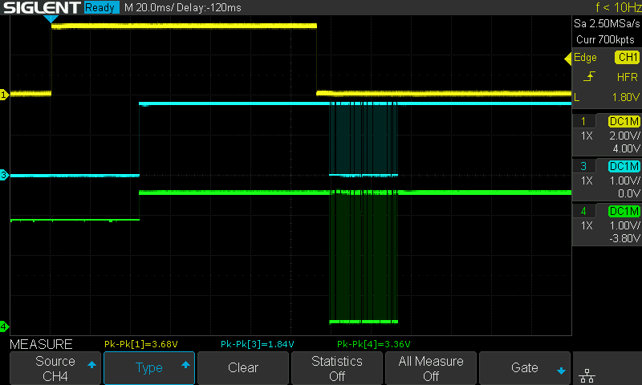

Channel | Signal |
--- | ---
**CH1:** | GPS ON_OFF (U5.4)
**CH3:** | UART TX (TP4)
**CH4:** | Out (J1.3)

#### GPS off

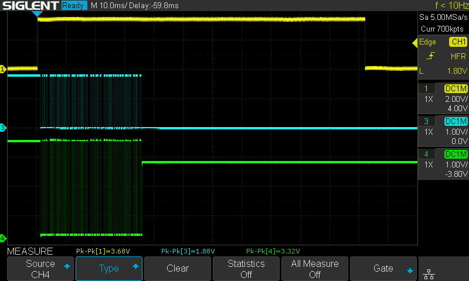

Channel | Signal |
--- | ---
**CH1:** | GPS ON_OFF (U5.4)
**CH3:** | UART TX (TP4)
**CH4:** | Out (J1.3)

#### Logic levels

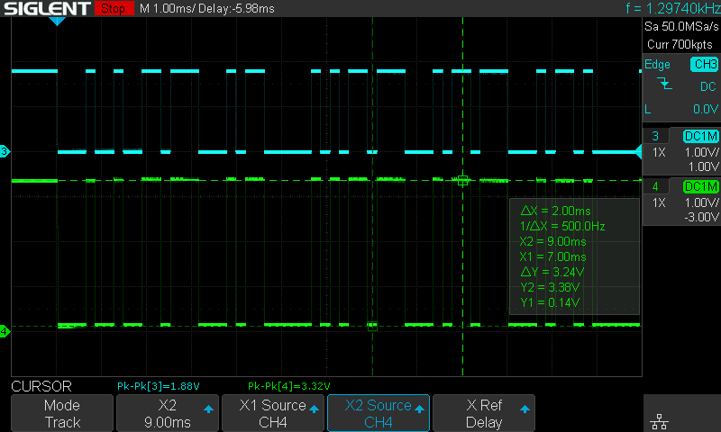

Channel | Signal |
--- | ---
**CH3:** | UART TX (TP4)
**CH4:** | Out (J1.3)

## Changes to the circuit during the tests

1. C1 and C5 changed to 22uF.
2. R9 changed to 10kOhm.
3. R6 changed to 300Ohm.
