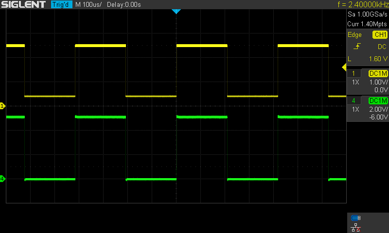

# Development tests of DIY GPS for Nikon DSLR

## Test equipment

1. Siglent SDS1204X-E oscilloscope
2. GOPHET CPS-3205 II power supply
3. UNI-T UT61E DMM
4. Siglent SDG1032X signal generator

## Tested Circuit

## Tests without the GPS module
The GPS module is hard to manually solder and especially desolder. Thus, before assembling it, I wanted to make sure that the circuit works as expected.

### Power-on

Channel  | Signal
--- | ---
**CH1:** | 5V
**CH2:** | 3.3V_EN (U4.3)
**CH3:** | 3.3V
**CH4:** | GPS_OUT

### Power-off

Channel  | Signal
--- | ---
**CH1:** | 5V
**CH2:** | 3.3V_EN (U4.3)
**CH3:** | 3.3V
**CH4:** | GPS_OUT

### On/off button

**Turning 3.3V on**

Channel  | Signal
--- | ---
**CH2:** | ON_SW (U3.1)
**CH3:** | 3.3V_EN (U4.3)
**CH4:** | 3.3V

**Turning 3.3V off**

Channel  | Signal
--- | ---
**CH2:** | ON_SW (U3.1)
**CH3:** | 3.3V_EN (U4.3)
**CH4:** | 3.3V

### Logic level shifting

Logic level shifting was tested by injecting pulses to the input of U2. Pulse frequency was 2400Hz and amplitude 3.3V.

**Rise time**

**Fall time**

**Output pulses with 3.3V input**

**Output pulses with 2.6V input**

One more issue I tried to test is response of the level shifting IC to LOW=0.4V and HIGH=2.475V pulses. The values were taken from the datasheet of the GPS module. Later, tests with GPS module assembled demonstrated that these pulses don't emulate the real-world voltage levels.

Channel  | Signal
--- | ---
**CH1:** | GPS_TX (C2)
**CH4:** | GPS_OUT
