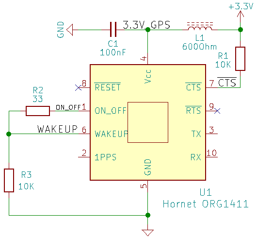

# ORG1411 GPS Module On/Off Tests

# Autonomous Power-On

Connecting WAKEUP output (pin 6) to ON_OFF input (pin 1) enables automatic GPS module start from Ready-To-Start state to Full Power state.

In the first version of Nikon GPS WAKEUP output (pin 6) is connected to ON_OFF input (pin 1) through the 30 Ohm resistor R2.

Channel  | Signal
--- | ---
**CH1:** | 3.3V
**CH2:** | None
**CH3:** | WAKEUP (pin 6)
**CH4:** | GPS_TX (p)in 3)

# On/Off Switch Configuration

In this configuration the GPS module is turned on and off by ON_OFF signal (pin 1) which is controlled by an external on/off button.

## Wake-Up After Power-On

GPS module wake-up with ON_OFF and WAKEUP disconnected.

Channel  | Signal
--- | ---
**CH1:** | 3.3V
**CH2:** | WAKEUP (pin 6)
**CH3:** | ON_OFF (pin 1)
**CH4:** | GPS_TX (pin 3)

Time from 3.3V wake-up to WAKEUP rise is 207.404ms. WAKEUP pulse length is 366us.

## On/Off Sequence

The ON_OFF pulse was generated by an external AWG.

Channel  | Signal
--- | ---
**CH1:** | 3.3V
**CH2:** | WAKEUP (pin 6)
**CH3:** | ON_OFF (pin 1)
**CH4:** | GPS_TX (pin 3)

## GPS On Sequence

Channel  | Signal
--- | ---
**CH1:** | 3.3V
**CH2:** | WAKEUP (pin 6)
**CH3:** | ON_OFF (pin 1)
**CH4:** | GPS_TX (pin 3)

## GPS Off Sequence

Channel  | Signal
--- | ---
**CH1:** | 3.3V
**CH2:** | WAKEUP (pin 6)
**CH3:** | ON_OFF (pin 1)
**CH4:** | GPS_TX (pin 3)
