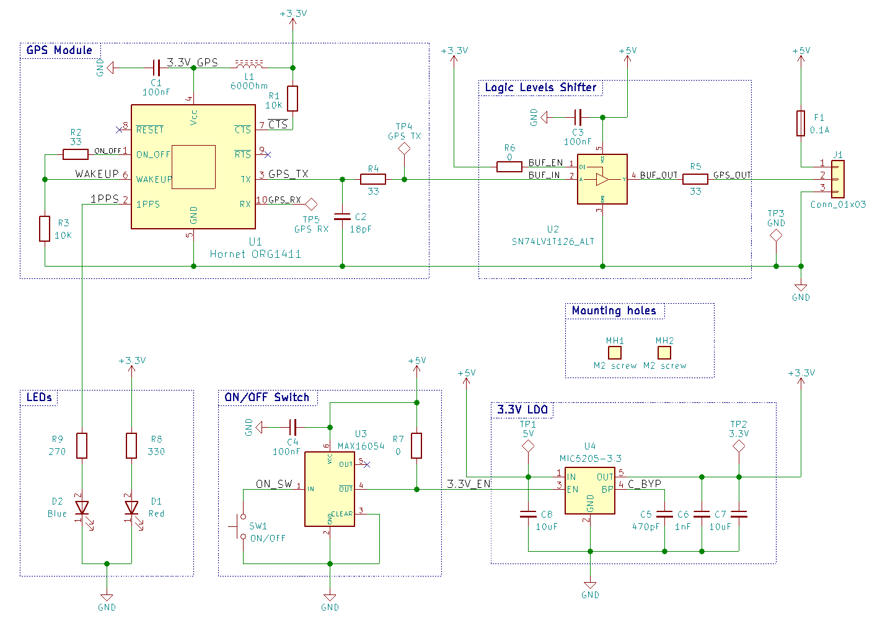
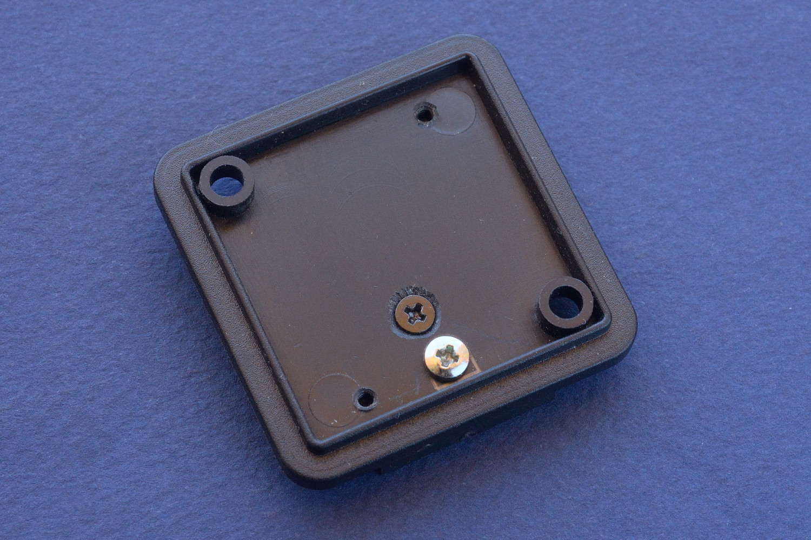
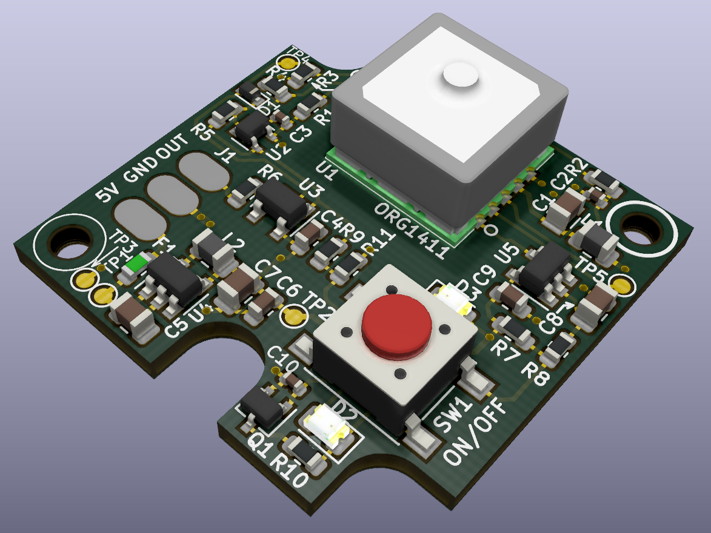
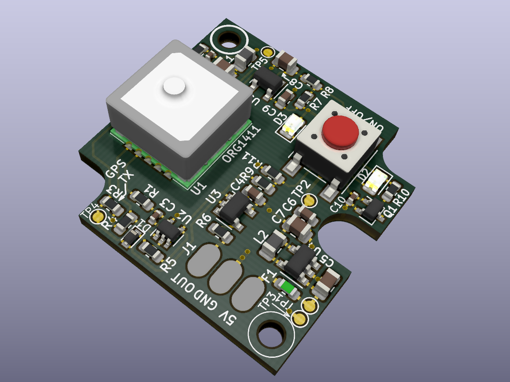
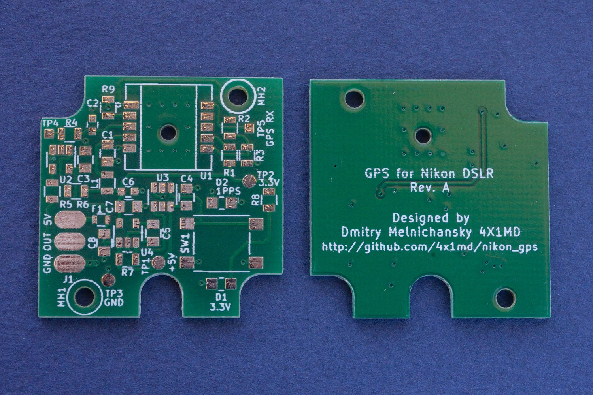
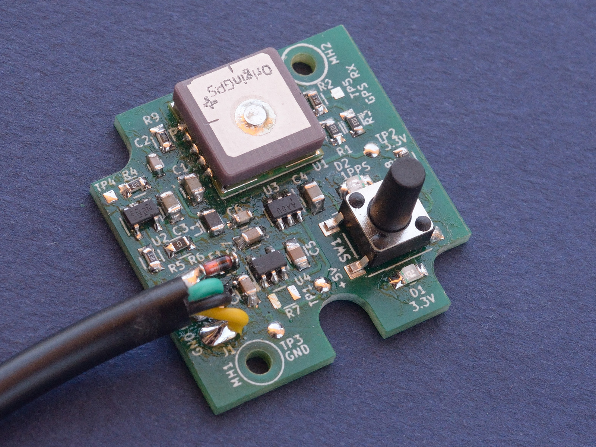
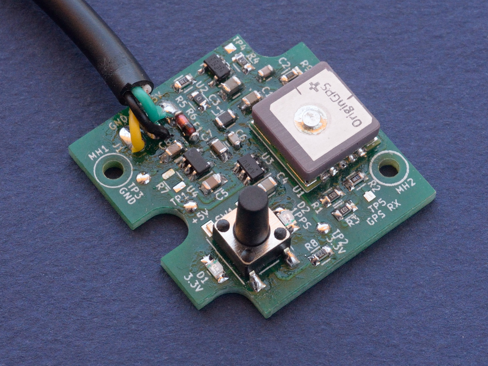
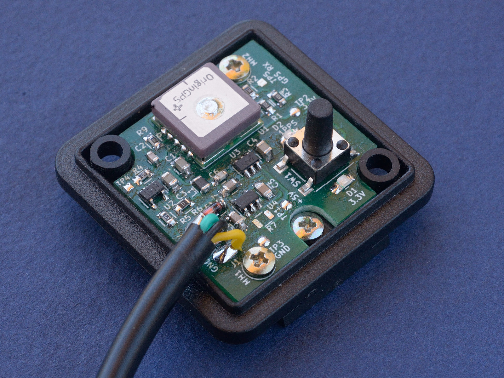
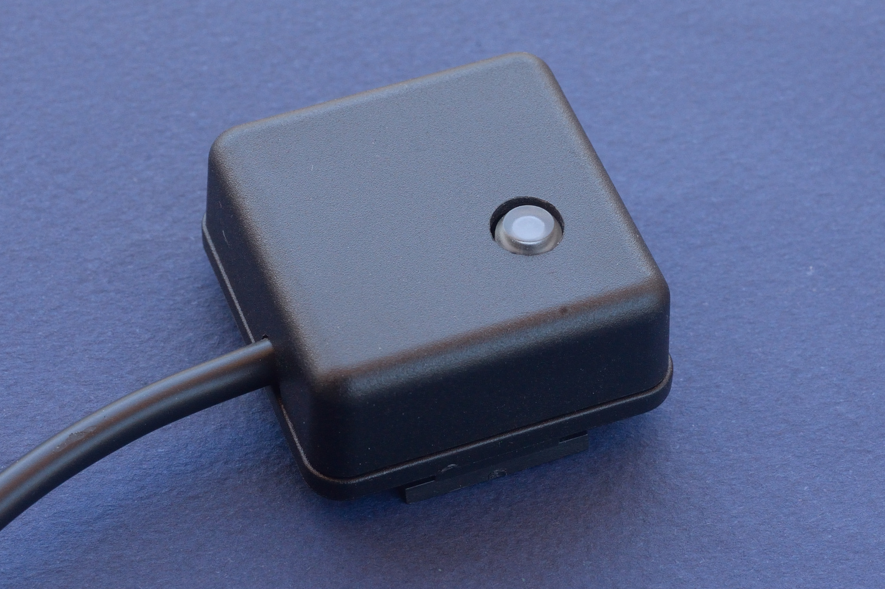

# Revision A of DIY GPS Module for Nikon DSLR

This document shows the first version of the project.

## Overview

The first version of the GPS had an LDO for providing the supply voltage to the GPS module. The GPS was turned off by disabling the LDO and turning off the supply voltage of the GPS module. This solution has one big disadvantage: the GPS module is turned off completely and doesn't keep any GPS data while off. Each time the module is turned on it acquires all the required GPS data consumes more current during the first minutes after power on. The delay of 3-5 minutes and even more makes this GPS module impractical while walking in a city when you turn the GPS on and off very often.

## Schematics

## Mechanics

## PCB Design

The PCB was designed in KiCAD.

### 3D Model

### Manufactured PCB

## Assembled Device

## Tests

The tests were done in order to verify the assembled circuit. Refer to [development-tests-rev-a.md](development-tests-rev-a.md) for test notes.

Go to [the main project page](../README.md)...
